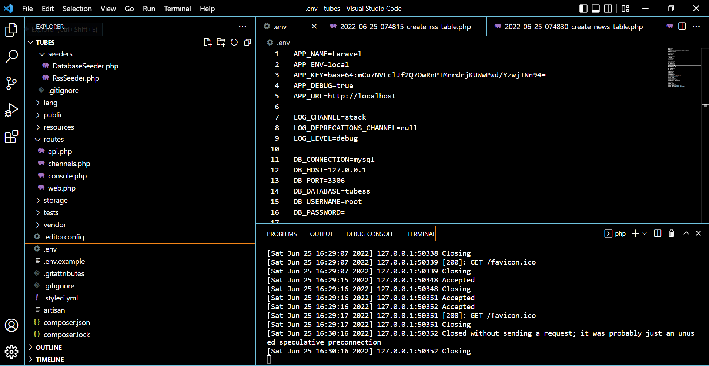
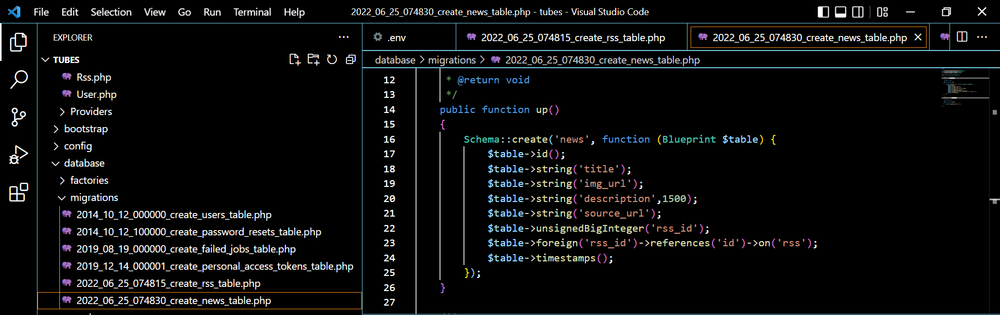
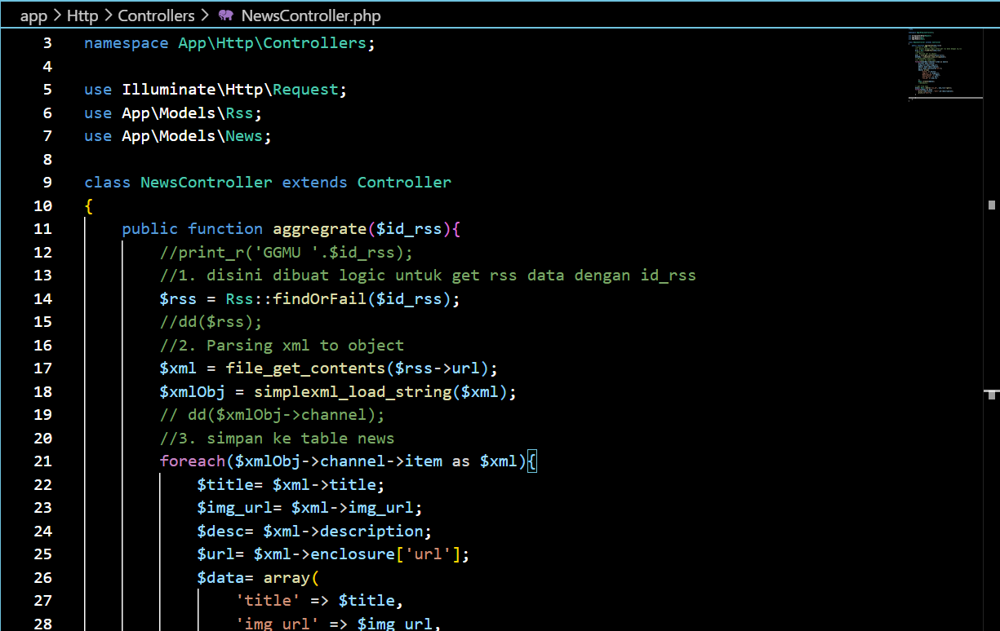
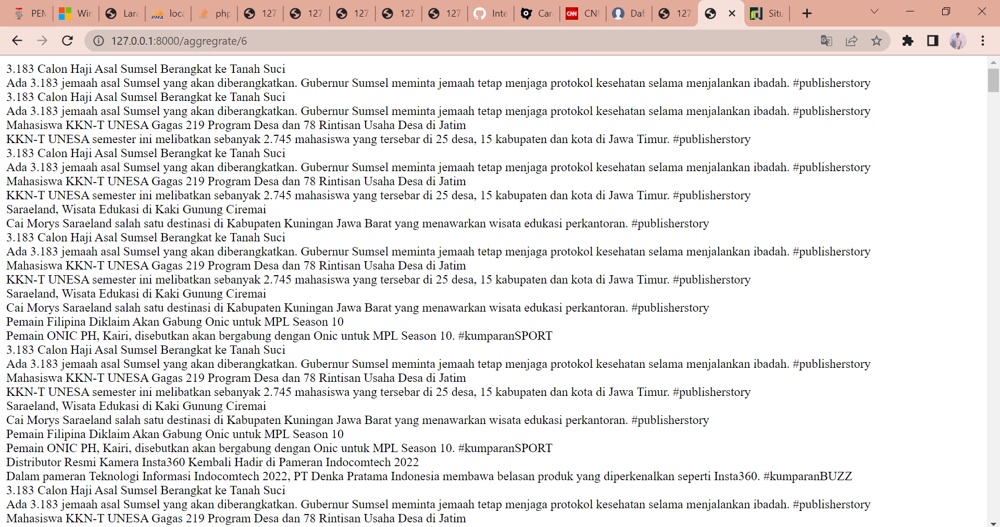

# TAHAP 2 - RSS #
---

• Mengubah DB_DATABASE di .env sesuai dengan nama database yang dibuat di phpmyadmin




• Buatlah 2 table rrs dan news dengan fitur migrations menggunakan syntax

```
php artisan make:migration create_rss_table

php artisan make:migration create_news_table
```


• Tambahkan kolom name dan url pada table rss




• Untuk menjalankan migrasi yang dibuat jalankan perintah diterminal , lalu cek database
php artisan migrate


• Buatlah koneksi model ke database dengan membuat seeder dan controller untuk tabel Rss dan News, dengan sytanx
```
    php artisan make:model Rss –seed -controller
```


• Edit file Rss.php, RssSeeder.php serta DatabaseSeeder.php 


•  Kemudian cek koneksi , dengan syntax


• Edit file News.php, NewsController.php, web.php, serta file migration News





• Cek dilokal host 

http://127.0.0.1:8000/aggregrate/1

http://127.0.0.1:8000/aggregrate/5

http://127.0.0.1:8000/aggregrate/6 

dan phpmyadmin





**Sakalangkong**

